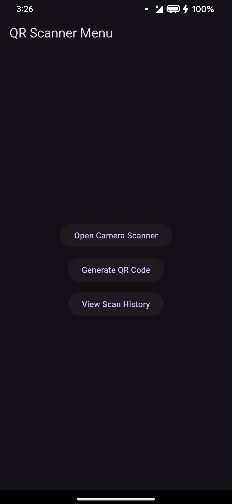
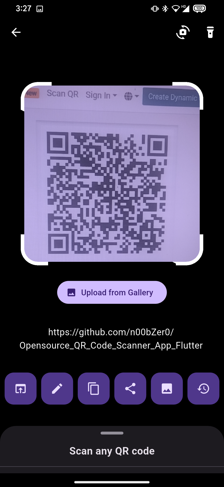
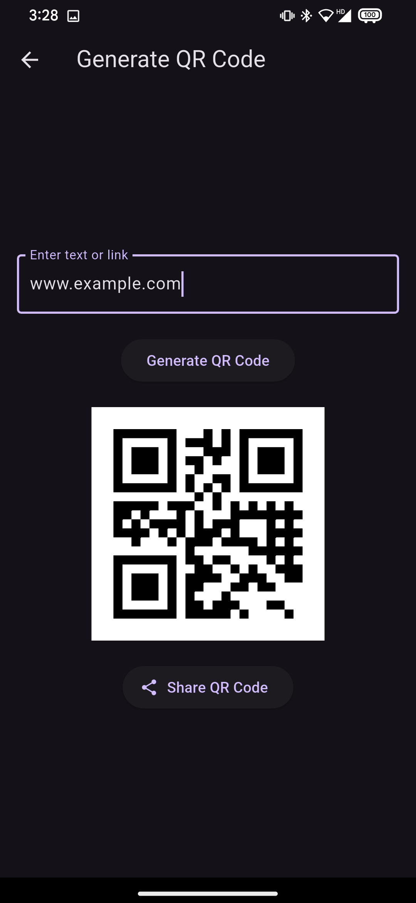

# 📱 QR & Barcode Scanner App

A **Flutter-based QR & Barcode Scanner** that allows users to **scan QR codes, generate QR codes, view scan history, and share scanned data**. 

---

## 🚀 Features

✅ **QR Code & Barcode Scanning** - Supports scanning of various QR code formats.  
✅ **Manual Capture Button** - Prevents auto scanning and scans only when the user presses "Capture".  
✅ **Auto-Focus & Flashlight Support** - Ensures clear scanning in low-light conditions.  
✅ **Scan from Gallery** - Allows users to select images from the gallery to extract QR codes.  
✅ **History of Scans** - Stores scanned data with the latest scans appearing at the top.  
✅ **Open Scanned Data Based on Type**  
   - URLs → Open in the default browser  
   - UPI Payment Codes → Open in UPI-supported apps  
   - Other text → Displayed in the app  

✅ **Generate QR Codes** - Create QR codes for custom text or links.  
✅ **Multi-format Support** - Supports QR, UPC, EAN, ISBN, Data Matrix, and more.  
✅ **Optimized UI** - Uses `SingleChildScrollView` & `ConstrainedBox` to prevent overflow issues.  
✅ **Prevents Duplicate History Entries** - Avoids repeating scanned data in history.  
✅ **Dark Mode & Custom Themes** - Enhances user experience.  

---

## 📸 **Screenshots**
| Home Screen | QR Scanner | Generate QR |
|------------|-----------|------------|
|  |  |  |

*(Screenshots should be placed inside a `screenshots/` folder in your repository.)*

---

## 🛠 **Installation Guide**

### **📌 Prerequisites**
- Install **Flutter SDK**: [Download Here](https://flutter.dev/docs/get-started/install)
- Install **Git**: [Download Here](https://git-scm.com/downloads)

### **📌 Steps to Run**
1. **Clone this repository**
   ```sh
   git clone https://github.com/n00bZer0/Opensource_QR_Code_Scanner_App_Flutter.git
